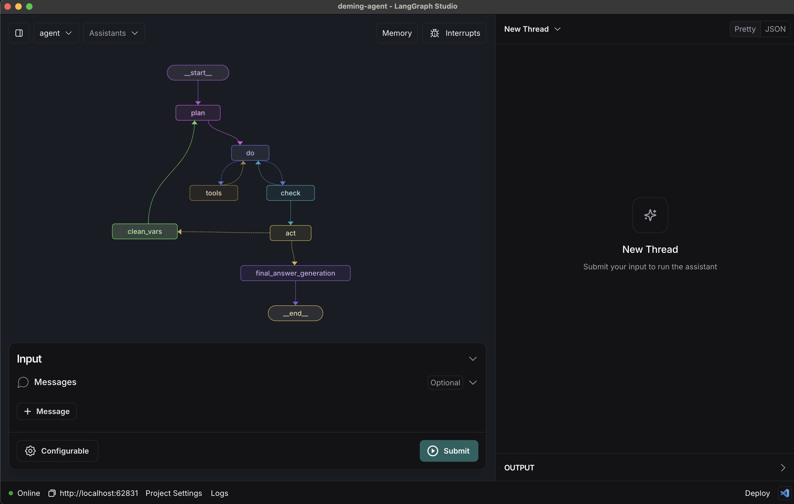

# LangGraph Deming Agent (autonomous agent)

[](https://github.com/langchain-ai/react-agent/actions/workflows/unit-tests.yml)
[](https://github.com/langchain-ai/react-agent/actions/workflows/integration-tests.yml)
[![Open in - LangGraph Studio](https://img.shields.io/badge/Open_in-LangGraph_Studio-00324d.svg?logo=data:image/svg%2bxml;base64,PHN2ZyB4bWxucz0iaHR0cDovL3d3dy53My5vcmcvMjAwMC9zdmciIHdpZHRoPSI4NS4zMzMiIGhlaWdodD0iODUuMzMzIiB2ZXJzaW9uPSIxLjAiIHZpZXdCb3g9IjAgMCA2NCA2NCI+PHBhdGggZD0iTTEzIDcuOGMtNi4zIDMuMS03LjEgNi4zLTYuOCAyNS43LjQgMjQuNi4zIDI0LjUgMjUuOSAyNC41QzU3LjUgNTggNTggNTcuNSA1OCAzMi4zIDU4IDcuMyA1Ni43IDYgMzIgNmMtMTIuOCAwLTE2LjEuMy0xOSAxLjhtMzcuNiAxNi42YzIuOCAyLjggMy40IDQuMiAzLjQgNy42cy0uNiA0LjgtMy40IDcuNkw0Ny4yIDQzSDE2LjhsLTMuNC0zLjRjLTQuOC00LjgtNC44LTEwLjQgMC0xNS4ybDMuNC0zLjRoMzAuNHoiLz48cGF0aCBkPSJNMTguOSAyNS42Yy0xLjEgMS4zLTEgMS43LjQgMi41LjkuNiAxLjcgMS44IDEuNyAyLjcgMCAxIC43IDIuOCAxLjYgNC4xIDEuNCAxLjkgMS40IDIuNS4zIDMuMi0xIC42LS42LjkgMS40LjkgMS41IDAgMi43LS41IDIuNy0xIDAtLjYgMS4xLS44IDIuNi0uNGwyLjYuNy0xLjgtMi45Yy01LjktOS4zLTkuNC0xMi4zLTExLjUtOS44TTM5IDI2YzAgMS4xLS45IDIuNS0yIDMuMi0yLjQgMS41LTIuNiAzLjQtLjUgNC4yLjguMyAyIDEuNyAyLjUgMy4xLjYgMS41IDEuNCAyLjMgMiAyIDEuNS0uOSAxLjItMy41LS40LTMuNS0yLjEgMC0yLjgtMi44LS44LTMuMyAxLjYtLjQgMS42LS41IDAtLjYtMS4xLS4xLTEuNS0uNi0xLjItMS42LjctMS43IDMuMy0yLjEgMy41LS41LjEuNS4yIDEuNi4zIDIuMiAwIC43LjkgMS40IDEuOSAxLjYgMi4xLjQgMi4zLTIuMy4yLTMuMi0uOC0uMy0yLTEuNy0yLjUtMy4xLTEuMS0zLTMtMy4zLTMtLjUiLz48L3N2Zz4=)](https://langgraph-studio.vercel.app/templates/open?githubUrl=https://github.com/langchain-ai/react-agent)

This template showcases a [ReAct agent](https://arxiv.org/abs/2210.03629) implemented using [LangGraph](https://github.com/langchain-ai/langgraph), designed for [LangGraph Studio](https://github.com/langchain-ai/langgraph-studio). This agent was built as a generalist agent that can tackle different task by using both LLMs and web search. The agent is **fully autonomous**, in the sense that it defines the steps to take, when to take each step and when to conclude with the tasks.



The core logic, defined in `src/react_agent/graph.py`, demonstrates a flexible Deming Agent that iteratively reasons about user queries and executes actions, showcasing the power of this approach for complex problem-solving tasks.

## What it does

The ReAct agent:

1. Takes a user **query** as input.
2. The Agent starts with no previous steps taken, and enters a Deming Cycle:
   1. **Plan**: Develop clear objectives and specific steps to achieve them. Identify potential challenges.
   2. **Do**: Execute the defined steps, utilizing available tools and web search capabilities.
   3. **Check**: Assess the results of the actions taken and gather feedback to determine success.
   4. **Act**: Based on the assessment, decide on the next steps, making adjustments as needed.
3. The Agent repeats steps 2.1-2.4 until the Agent decides that the task was successfully achieved. Then, it undergoes to a final step where the response is formatted in a more user-friendly way to the user.

By default, it's set up with a basic set of tools, but can be easily extended with custom tools to suit various use cases.

## Getting Started

Assuming you have already [installed LangGraph Studio](https://github.com/langchain-ai/langgraph-studio?tab=readme-ov-file#download), to set up:

1. Create a `.env` file.

```bash
cp .env.example .env
```

2. Define required API keys in your `.env` file.

The primary [search tool](./src/react_agent/tools.py) [^1] used is [Tavily](https://tavily.com/). Create an API key [here](https://app.tavily.com/sign-in).
Then, a LLM API key could also be set if needed. An example of this would be:

```bash
TAVILY_API_KEY=...
OPENAI_API_KEY=...
```

3. Customize whatever you'd like in the code.
4. Open the folder LangGraph Studio!
